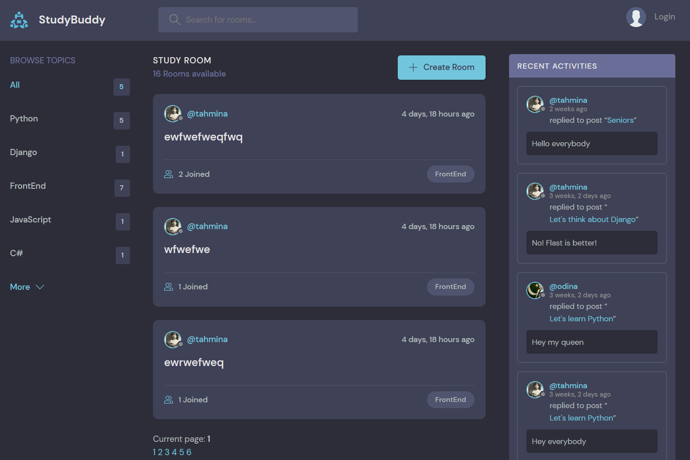
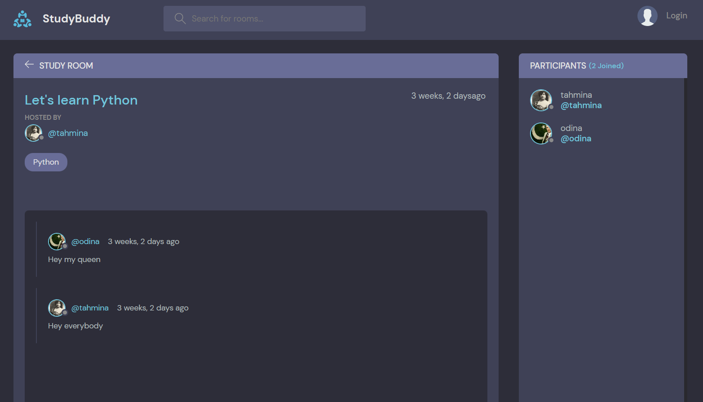
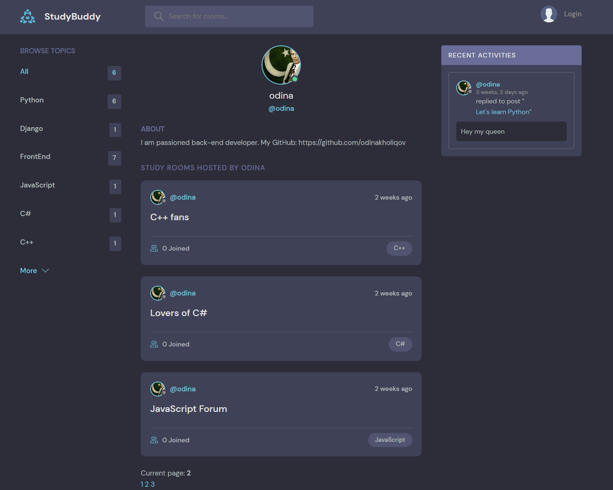

# StudyBud - easiest way to talk over text
Imagine a place where you can belong to a school club, a gaming group, or a worldwide art community. Where just you and a handful of friends can spend time together. A place that makes it easy to talk every day and hang out more often.

## App Preview

### Main page

### Inside of a room

### User Profile

-------------
## Cloning the repository

1. Clone the repository using the command below:

> git clone git@github.com:odinakholiqov/studybud.git

2. Move into the directory where we have the project files :

> cd StudyBud

3. Create a virtual environment :

> #Let's install virtualenv first 
> pip install virtualenv
> #Then we create our virtual environment 
> virtualenv envname

4. Activate the virtual environment :
> envname\scripts\activate

5. Install the requirements :

> pip install -r requirements.txt
